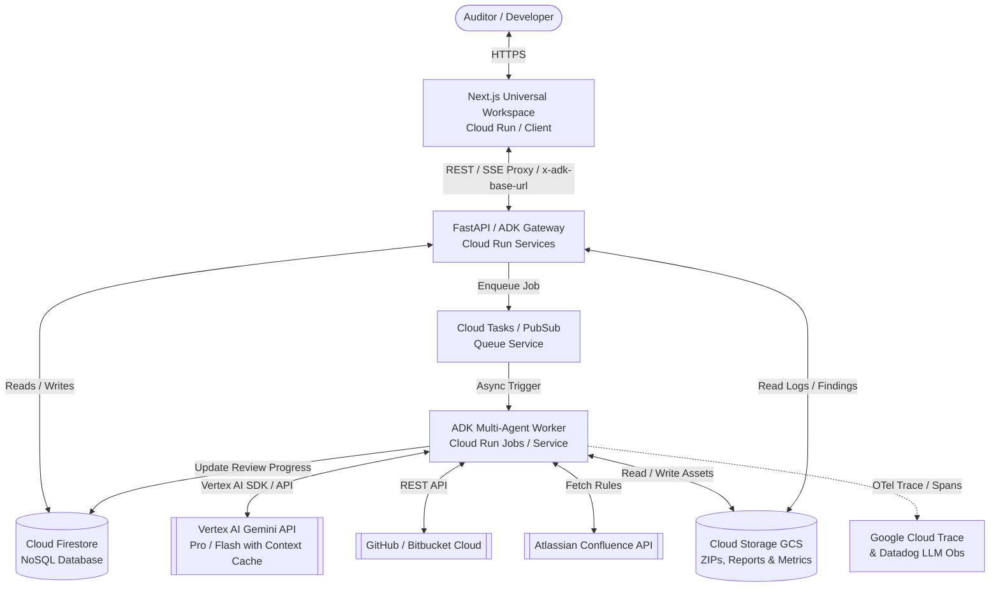
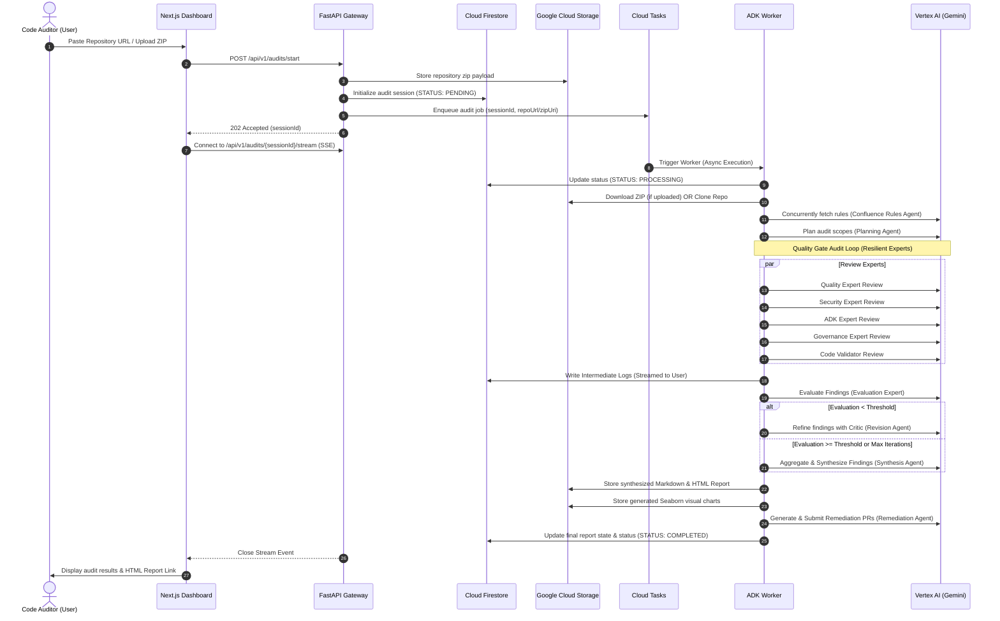

# Production-Grade Architecture Plan: Agent Guardian
**System Owner:** AI Center of Excellence (CoE)  
**Service Name:** `agenticai.agentguardian`  
**Classification:** Enterprise Internal Tool

---

## 1. Executive Summary
**Agent Guardian** is an automated, multi-agent codebase auditing and remediation system built on the **Google Agent Development Kit (ADK 2.0+)** and powered by **Vertex AI Gemini** models. The architecture provides a decoupled, serverless cloud-native system on **Google Cloud Platform (GCP)** coupled with a universal **Agent Guardian web workspace** that communicates with any Google ADK backend app.

Key highlights of this production architecture include:
*   **Universal ADK Web Workspace:** Next.js 16 + React 19 interface with dynamic app discovery (`GET /list-apps`), upstream header proxying (`x-adk-base-url`), and responsive multi-device support.
*   **Interactive Tool & Thought Telemetry:** Real-time rendering of reasoning chains (`thought`), tool calls with JSON argument inspection, tool returns, and raw event inspection.
*   **Decoupled Asynchronous Processing:** Isolates long-running multi-agent audits from web requests using a serverless task queue and real-time SSE streams.
*   **Vertex AI Context Caching:** Minimizes LLM cost and response latency by caching large codebase structures during iterative reviews (up to 90% token reduction).
*   **End-to-End Observability:** Integrates Google Cloud Trace (via OpenTelemetry) and Datadog LLM Observability for span attribution.
*   **Infrastructure-as-Code & Secure DevSecOps:** Fully managed using Terraform with strict workload identity federation (OIDC) via Bitbucket Pipelines.

---

## 2. Cloud-Native Topology
The system architecture uses a serverless, decoupled, and microservices-oriented topology on GCP:



### Components Breakdown
1.  **Next.js Universal Workspace (Cloud Run - Frontend):** Modern Agent Guardian Workspace interface, interactive tool/thought viewers, Mission Control drawer, and responsive sidebar navigation. Auto-scales from 0 to N.
2.  **FastAPI / ADK Gateway (Cloud Run - API):** Exposes universal ADK endpoint schemas (`/list-apps`, `/apps/*`, `/run_sse`), manages repository webhook triggers, starts audits, and streams real-time logs via Server-Sent Events (SSE).
3.  **Cloud Tasks / Pub/Sub (Queue):** Provides reliable asynchronous delivery of audit jobs with built-in retry mechanics, rate limiting, and backoff.
4.  **ADK Workflow Worker (Cloud Run Job/Service):** The heavy-lifting compute worker containing the ADK `review_pipeline` workflow. It executes concurrently and can be assigned dedicated execution limits (e.g., up to 60 minutes).
5.  **Cloud Firestore (NoSQL Store):** Persists session history, real-time logging buffers, active state (`ctx.session.state`), and granular audit metrics.
6.  **Google Cloud Storage (Object Store):** Securely archives uploaded codebase archives, parsed files, generated HTML dashboards, and Seaborn visual assets.

---

## 3. Data Flow & Audit Lifecycle
The processing sequence of a codebase audit from request to automated pull request creation:



---

## 4. Production Resiliency & Cost Management
The system configuration implements strict resiliency patterns directly aligned with Google ADK:

### A. LLM Cost & Latency Optimization (Vertex Context Caching)
Code audits involve sending large files (source code structures) to Gemini. Under standard configurations, this leads to massive token overhead.
*   **ADK Configuration:** The pipeline leverages ADK's `ContextCacheConfig` with `min_tokens=15000` and a TTL of `3600` seconds.
*   **Implementation:** Large repository assets, rules, and schemas are cached inside Vertex AI's context cache. Sub-agents (Quality, Security, Governance) hitting the same model within an hour benefit from up to **90% reduced token costs** and near-instant processing.

### B. Conversation Management (Events Compaction)
To prevent LLM context-window saturation during long runs or multiple revision loops:
*   **ADK Configuration:** Configured with `EventsCompactionConfig` where `compaction_interval=1` and `overlap_size=1`.
*   **Implementation:** The system automatically summarizes older dialogue history, keeping only the current status, instructions, and immediately preceding critiques active.

### C. Graceful Degradation (Resiliency Wrappers)
Rather than allowing a single transient tool timeout (e.g., a Confluence query failure or a single expert agent error) to abort the entire review pipeline:
*   **Fault-Tolerant Nodes:** The pipeline uses `harden_node(...)` on coordination agents (Planning, Evaluation, Synthesis) to perform exponential-backoff retries.
*   **Failsafe Leaf Agents:** High-risk experts are wrapped inside the `resilient(...)` decorator. If an expert agent fails continuously, it falls back to a `"[SYSTEM_NOTE: Analysis skipped]"` token, allowing the `synthesis_agent` and `html_agent` to assemble a valid, partial report instead of crashing the process.

---

## 5. Storage & Database Schema
To support high-concurrency audits, state tracking is divided between object storage and Firestore.

### A. Firestore Document Schema (Collection: `audits`)
```json
{
  "sessionId": "string (UUID)",
  "status": "PENDING | PROCESSING | COMPLETED | FAILED",
  "repository": {
    "owner": "string",
    "repo": "string",
    "branch": "string"
  },
  "metrics": {
    "score": "number (0-10)",
    "vulnerabilities": {
      "critical": "number",
      "high": "number",
      "medium": "number",
      "low": "number"
    },
    "adkBestPractices": "number",
    "testCoverage": "number"
  },
  "artifacts": {
    "htmlReportUrl": "string (GCS URI)",
    "markdownReportUrl": "string (GCS URI)",
    "metricsChartUrl": "string (GCS URI)"
  },
  "error": "string | null",
  "createdAt": "timestamp",
  "updatedAt": "timestamp"
}
```

### B. Google Cloud Storage Bucket Structure
```
gs://agenticai-agentguardian-prod-assets/
├── uploads/                     # Temporary repository ZIP files
│   └── [sessionId].zip
├── charts/                      # Generated Seaborn health visualizations
│   └── [sessionId]_health.png
└── reports/                     # Output audit artifacts
    ├── [sessionId]_executive.md
    └── [sessionId]_dashboard.html
```

---

## 6. CI/CD & Infrastructure as Code (IaC)
To guarantee consistency across environments, infrastructures are provisioned programmatically:

### A. Infrastructure Configuration (Terraform)
We configure resources in Terraform to:
*   Define resources for Cloud Run services, IAM service accounts, Firestore Databases, GCS buckets, and Cloud Tasks queues.

### B. Deployment Pipeline (Bitbucket Pipelines)
Integrated directly via `bitbucket-pipelines.yml`:
1.  **Code Validation:** Run metadata validity checks and SonarCloud scan tasks.
2.  **Security Analysis:** Run Checkmarx scanning pipeline to discover vulnerabilities in the codebase before deploying.
3.  **IaC Stages:** Automatically plan and apply Terraform-based configurations (`terraform plan` and `terraform apply -auto-approve` upon master branch mergers) with workload identity federation (OIDC) eliminating the risk of hardcoded GCP service keys.
4.  **Continuous Deploy:** Package the backend and frontend into Docker containers, push to Google Artifact Registry, and release to Google Cloud Run.

---

## 7. Observability, Telemetry & Security
A production auditing platform must possess world-class observability to track agent decisions and protect proprietary source code.

### A. Observability and Telemetry
*   **OpenTelemetry Integration:** Configured with `setup_platform_compat()` and `maybe_set_otel_providers(otel_hooks_to_setup=[hooks])` in the entry point to push full trace propagation directly to **Google Cloud Trace**.
*   **Error Demoting:** Custom `_McpTimeoutFilter` blocks noisy, non-critical MCP/network session timeout logs from flooding the system, while ensuring genuine authorization or permission failures reach Cloud Run logs instantly.

### B. Security Hardening
*   **Identity & Credentials Protection:** Strict adherence to OIDC. The API and Workers run under minimal-permission Google IAM Service Accounts (`svc-bitbucket-pipeline@...`).
*   **Strict Scope Isolation:** The `planning_agent` extracts and authorizes the repository context using a sanitizing regular expression callback. Experts and validation tools are strictly bound to access **only** files inside the workspace directory, completely preventing path-traversal vulnerabilities.
*   **LLM Safety Settings:** Configured via `safety_config` with robust safety thresholds (`HARM_CATEGORY_DANGEROUS_CONTENT` tuned to `BLOCK_ONLY_HIGH` to allow technical analysis of security vulnerabilites without triggering false-positive blocks).
