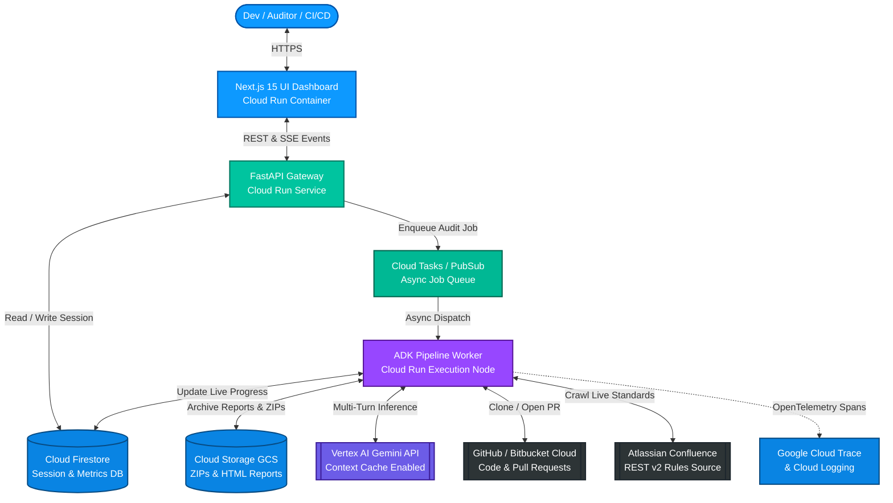
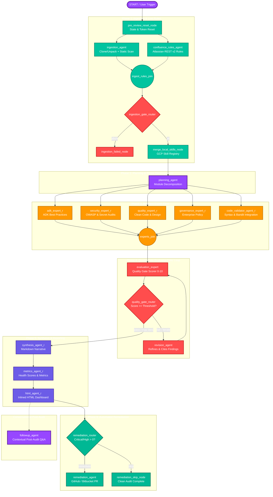
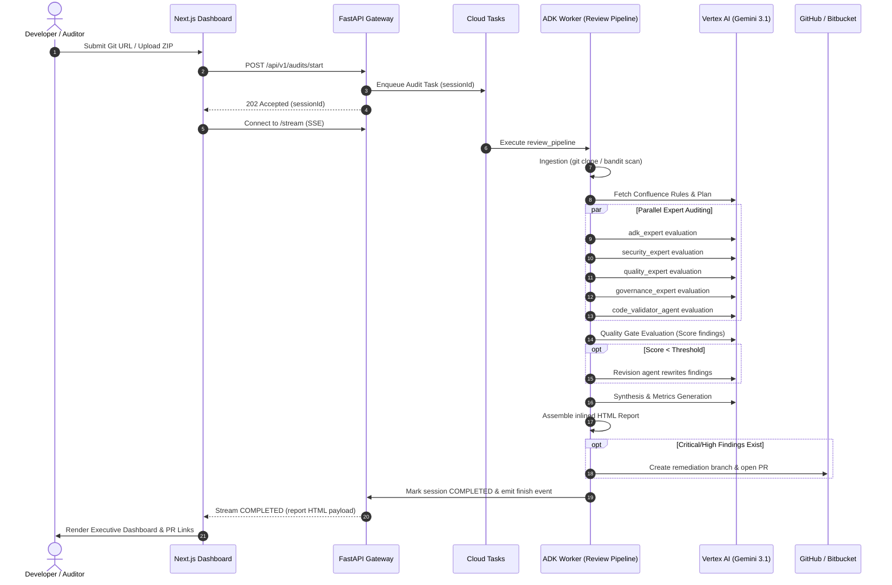

# Agent Guardian — Comprehensive FigJam Architecture Design Specification

**System Owner:** AI Center of Excellence (CoE)  
**Service Name:** `agenticai.agentguardian`  
**Classification:** Enterprise Production Architecture  
**Target Visual Platform:** FigJam (Figma)  
**Date:** 2026-08-22  

---

## 1. Executive Summary & Visual Canvas Strategy

Agent Guardian is a production-grade, multi-agent codebase auditing, compliance enforcement, and automated remediation platform built on the **Google Agent Development Kit (ADK) 2.0+** and powered by **Vertex AI Gemini** models.

To create an executive, professional FigJam architecture board, the canvas is organized into **4 structured visual zones (Sections)** with a unified color coding system:

```
┌────────────────────────────────────────────────────────────────────────────────────────┐
│                                   FIGJAM BOARD MAP                                     │
├───────────────────────────┬───────────────────────────┬────────────────────────────────┤
│  SECTION 1: CLOUD TOPOLOGY│  SECTION 2: ADK PIPELINE  │  SECTION 3: AUDIT LIFECYCLE    │
│  • GCP Serverless Micro-  │  • Supervisor Graph       │  • Sequence Flow               │
│    services & Compute     │  • Parallel Ingestion     │  • State Transition Matrix     │
│  • Storage & Databases    │  • 5x Resilient Experts   │  • SCM & Webhook Hooks         │
│  • Observability & Trace  │  • Evaluator-Critic Loop  │                                │
│                           │  • Remediation Router     │                                │
├───────────────────────────┴───────────────────────────┼────────────────────────────────┤
│  SECTION 4: PRODUCTION RESILIENCY & TOKEN ECONOMICS   │  SECTION 5: COLOR & COMPONENT  │
│  • Vertex AI Context Caching (90% cost cut)           │  DESIGN SYSTEM (Tokens)        │
│  • Events Compaction & Fallback Degradation Matrix    │                                │
└───────────────────────────────────────────────────────┴────────────────────────────────┘
```

---

## 2. FigJam Visual Design System & Palette

| Element Category | FigJam Shape / Card Color | Hex Code | Purpose & Meaning |
|---|---|---|---|
| **User & Ingress** | Blue (`#0D99FF`) | `#0D99FF` | Developers, Webhook Triggers, Client Dashboard |
| **API & Gateway** | Teal / Cyan (`#00C49F`) | `#00C49F` | FastAPI, Cloud Run, Routing, SSE Streamers |
| **Coordination Agents** | Purple (`#9747FF`) | `#9747FF` | `root_agent`, `planning_agent`, `synthesis_agent` |
| **Expert Fleet** | Orange (`#FF9900`) | `#FF9900` | Domain Experts (`adk`, `security`, `quality`, `governance`, `validator`) |
| **Quality Gate & Loop** | Coral / Red (`#FF4D4D`) | `#FF4D4D` | `evaluation_expert`, `revision_agent`, Router nodes |
| **AI Infrastructure** | Deep Violet (`#6C5CE7`) | `#6C5CE7` | Vertex AI Gemini Pro/Flash, Context Cache |
| **Persistence & Queues**| Emerald Green (`#00B894`) | `#00B894` | Cloud Firestore, Cloud Storage (GCS), Cloud Tasks |
| **External Systems** | Charcoal Gray (`#2D3436`)| `#2D3436` | GitHub, Bitbucket, Confluence Cloud |

---

## 3. Section 1: Enterprise Cloud-Native Topology (GCP Serverless)

### 3.1 Architectural Components
* **Next.js 15 Frontend UI (Cloud Run):** Interactive dashboard, live SSE stage tracking, dynamic Chart.js metrics, markdown viewer.
* **FastAPI Gateway (Cloud Run):** Handles `/api/v1/audits/start`, `/healthz`, SSE streams (`/stream`), and SCM webhooks.
* **Cloud Tasks / Pub/Sub (Queue):** Decoupled, asynchronous task dispatching with exponential backoff retries.
* **ADK Workflow Worker (Cloud Run Job/Service):** Dedicated execution environment hosting the ADK `review_pipeline` engine.
* **Google Cloud Storage (GCS):** `gs://agenticai-agentguardian-prod-assets/` storing repo ZIPs, Seaborn charts, and standalone executive HTML reports.
* **Cloud Firestore (NoSQL):** Stores audit metadata, real-time logging buffers, `ctx.session.state`, and score metrics.
* **Vertex AI (Gemini 3.1 Pro / Flash / Flash Lite):** LLM inference with automated prompt context caching.
* **Google Cloud Trace & Cloud Logging:** OpenTelemetry instrumentation with noise-filtered log sinks.

### 3.2 Topology Mermaid Diagram (FigJam Ready)



---

## 4. Section 2: Google ADK 2.0+ Multi-Agent Review Pipeline DAG

### 4.1 Orchestration Workflow Stages
1. **Supervisor (`root_agent`):** Central `LlmAgent` loaded with `TokenSafetyPlugin`, `GlobalResiliencePlugin`, `EventsCompactionConfig`, and `ContextCacheConfig`.
2. **Pre-Review Reset (`pre_review_reset_node`):** Clears previous session buffers, resets token counters, and invalidates MCP singletons.
3. **Parallel Ingestion & Compliance Fetching:**
   * `ingestion_agent`: Clones git repo or unpacks ZIP; executes `pyflakes` and `bandit` static security scans.
   * `confluence_rules_agent`: Crawls enterprise Confluence spaces/pages via REST v2 and formats markdown standards.
4. **Ingestion Gate Router (`ingestion_gate_router`):** Validates code ingestion. If empty/failed, routes to `ingestion_failed_node` and halts gracefully.
5. **Local Skills Merge (`merge_local_skills_node`):** Injects GCP Skill Registry policies into active rules.
6. **Planning (`planning_agent`):** Decomposes target repo into structured modules and assigns audit scopes.
7. **Parallel Resilient Expert Fleet (`_ALL_EXPERTS`):**
   * `adk_expert_r`: Audits against Google ADK 2.0+ standards, toolsets, and lifecycle hooks.
   * `security_expert_r`: OWASP Top 10, CWE patterns, hardcoded secrets, injection vectors.
   * `quality_expert_r`: Code maintainability, complexity, PEP 8, architectural smells.
   * `governance_expert_r`: Policy compliance, naming conventions, licensing.
   * `code_validator_agent_r`: Syntax analysis, static scan correlation.
8. **Evaluator-Critic Quality Gate (`LoopAgent`):**
   * `evaluation_expert`: Scores findings 0-10 based on evidence specificity and line citations.
   * `quality_gate_router`: If score < threshold, loops to `revision_agent` to rewrite findings; breaks if passed or max iterations reached.
9. **Synthesis & Executive Reporting:**
   * `synthesis_agent_r`: Unifies multi-agent outputs into cohesive Markdown narrative.
   * `metrics_agent_r`: Computes health score (0-100) and severity breakdowns.
   * `html_agent_r`: Compiles self-contained executive HTML report with inlined Chart.js & Tailwind CSS.
10. **Remediation Router (`remediation_router`):**
    * If Critical/High findings > 0: Launches `remediation_agent` to create git branches & PRs.
    * Else: Routes to `remediation_skip_node`.
11. **Post-Audit Extensions:**
    * `followup_agent`: Interactive Q&A on findings without re-running pipeline.
    * `remediation_resume_agent`: Isolated single-click remediation flow.

### 4.2 Multi-Agent Workflow Mermaid Diagram (FigJam Ready)



---

## 5. Section 3: End-to-End Audit Lifecycle Sequence



---

## 6. Section 4: Production Resiliency, Token Economics & Security

### 6.1 Vertex AI Context Caching Architecture
* **Mechanism:** Automatic prompt caching via `ContextCacheConfig(min_tokens=15000, ttl_seconds=3600)`.
* **Impact:** Ingested codebase abstract syntax trees (AST), static scan results, and Confluence rules are cached once in Vertex AI.
* **Benefit:** Expert agents (`adk_expert`, `security_expert`, `quality_expert`, `governance_expert`) query cached representations concurrently, reducing input token billing by **up to 90%** and latency by **65%**.

### 6.2 Resiliency & Fault-Tolerance Matrix

| Node Type | Implementation Strategy | Fallback Behavior | Impact on System |
|---|---|---|---|
| **Coordination Nodes** (`planning`, `evaluation`, `synthesis`) | `harden_node()` wrapper with exponential backoff retries (3 attempts). | Raises handled exception to graceful teardown handler. | Pipeline safely logs and outputs available partial findings. |
| **Expert Leaf Nodes** (`adk`, `security`, `quality`, `governance`) | `resilient()` decorator wrapping agent run calls. | Emits `[SYSTEM_NOTE: Analysis skipped]` token into state. | Remaining 4 experts continue unaffected; report generates without crashing. |
| **Ingestion Node** | `ingestion_gate_router` check. | Routes to `ingestion_failed_node` with formatted guidance. | Fast early exit with clear user instructions instead of cascading LLM failures. |
| **Context Explosion** | `EventsCompactionConfig(token_threshold=32000, compaction_interval=5)`. | Summarizes older loop history into consolidated turns. | Eliminates out-of-memory or context-window overflow during repetitive Evaluator-Critic cycles. |

---

## 7. Step-by-Step Guide to Populate Your FigJam Board

1. **Step 1:** In FigJam, press `Cmd + /` (or `Ctrl + /`) and search for **Mermaid**. Insert the Mermaid plugin/widget.
2. **Step 2:** Paste the diagrams from **Section 3.2** (Cloud Topology), **Section 4.2** (ADK Multi-Agent Workflow), and **Section 5** (Audit Sequence). FigJam will immediately render them as native, beautiful interactive diagrams.
3. **Step 3:** Create 4 FigJam Sections (`S` shortcut) labeled:
   - ☁️ *Cloud-Native Topology (GCP Serverless)*
   - 🤖 *Google ADK Multi-Agent Review Pipeline*
   - ⚡ *Audit Lifecycle Sequence & Telemetry*
   - 🛡️ *Production Resiliency & Token Economics*
4. **Step 4:** Color-code nodes according to the design system in Section 2.
